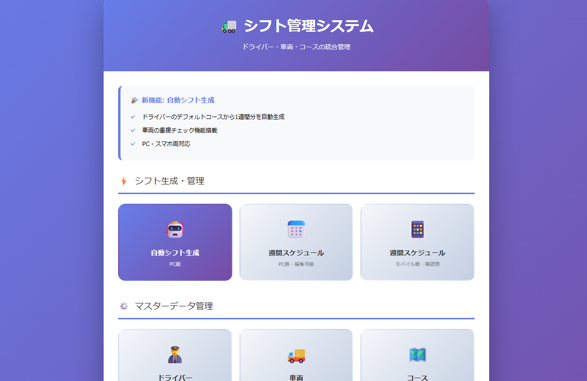
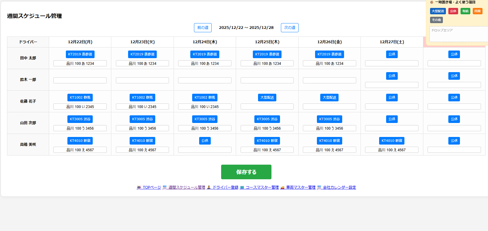
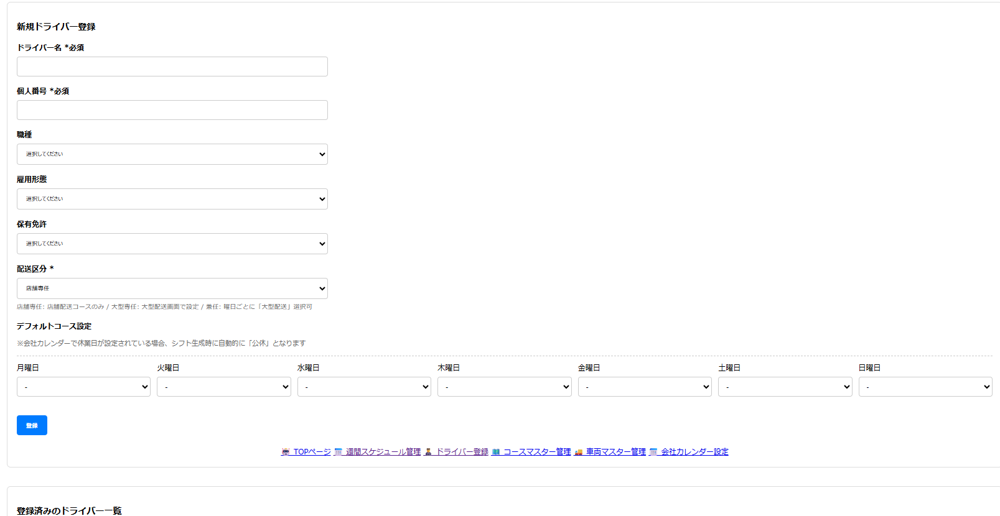

# 🚛 運送業向けシフト管理システム

中小運送会社向けのシンプルなシフト管理システムです。  
ドライバー・車両・コースを一元管理し、ドラッグ&ドロップで直感的にシフトを編集できます。



---

## ✨ 特徴

- **直感的な操作** - ドラッグ&ドロップでシフト編集
- **二系統管理** - 店舗配送・大型配送を分けて管理
- **低コスト運用** - PHP + JSONファイルで動作、DBサーバー不要
- **カスタマイズ可能** - シンプルな構成で改修しやすい

---

## 📸 スクリーンショット

### 週間スケジュール管理


### ドライバー登録


### コースマスター


---

## 🛠️ 機能一覧

### シフト管理
- 週間スケジュール表示・編集
- ドラッグ&ドロップでコース入れ替え
- 公休・有給・同乗などの一時置き場から即座に設定
- 店舗配送 / 大型配送の二系統管理

### マスター管理
- ドライバー登録（店舗専任/大型専任/兼任）
- コースマスター（曜日別設定）
- 車両マスター
- 会社カレンダー（定休日・特別休業日・特別出勤日）

### その他
- 休み申請・承認機能
- 自動シフト生成（ベース機能）
- レスポンシブ対応

---

## 💻 動作環境

| 項目 | 要件 |
|------|------|
| PHP | 7.4 以上 |
| Webサーバー | Apache / nginx |
| ブラウザ | Chrome / Edge / Firefox / Safari（最新版推奨） |

※ データベース不要（JSONファイルで管理）

---

## 📦 インストール方法

### 1. ダウンロード

```bash
git clone https://github.com/[gamu1204-boop]/shift_system.git
```

または「Code」→「Download ZIP」でダウンロード

### 2. サーバーに配置

```bash
# 例：Apacheの場合
cp -r shift_system/src/* /var/www/html/shift/
```

### 3. 権限設定

```bash
# JSONファイルの書き込み権限
chmod 666 /var/www/html/shift/*.json
```

### 4. アクセス

ブラウザで `http://[サーバーアドレス]/shift/` にアクセス

---

## 🚀 クイックスタート（ローカル環境）

PHPのビルトインサーバーで簡単に試せます。

```bash
cd shift_system/src
php -S localhost:8000
```

ブラウザで `http://localhost:8000` にアクセス

---

## 📁 フォルダ構成

```
shift_system/
├── README.md              # このファイル
├── LICENSE                # MITライセンス
├── docs/
│   └── screenshots/       # スクリーンショット
├── sample_data/           # デモ用サンプルデータ
│   ├── drivers.json
│   ├── courses.json
│   ├── courses_large.json
│   ├── vehicles.json
│   ├── company_calendar.json
│   └── schedule.json
└── src/                   # ソースコード
    ├── index.html         # トップページ
    ├── pc_schedule.php    # 店舗配送スケジュール
    ├── pc_schedule_large.php  # 大型配送スケジュール
    ├── driver_regist.php  # ドライバー登録
    ├── course_regist.php  # コースマスター
    ├── course_regist_large.php  # 大型コースマスター
    ├── vehicle_regist.php # 車両マスター
    ├── company_calendar.php   # 会社カレンダー
    └── *.json             # データファイル
```

---

## 📝 サンプルデータ

`sample_data/` フォルダに動作確認用のサンプルデータが入っています。

```bash
# サンプルデータを使う場合
cp sample_data/*.json src/
```

### サンプルドライバー
| 名前 | 区分 | 担当 |
|------|------|------|
| 田中 太郎 | 店舗専任 | KT2019 表参道 |
| 鈴木 一郎 | 大型専任 | 大型コース |
| 佐藤 花子 | 兼任 | 月〜水:店舗 / 木〜金:大型 |

---

## ⚙️ カスタマイズ

### コース名の変更
`courses.json` を編集してコース名・車両を設定

### 休日オプションの追加
`driver_regist.php` の `holidayOptions` 配列を編集

### デザイン変更
各PHPファイル内の `<style>` タグを編集

---

## 🤝 カスタマイズ・導入支援

以下のサポートを承っております。

- **導入支援** - サーバー構築・初期設定
- **カスタマイズ開発** - 機能追加・業務フローに合わせた改修
- **保守サポート** - 月額サポート契約

お気軽にお問い合わせください。

📧 **連絡先:** [gamu1204@gmail.com]

---

## 📜 ライセンス

[MIT License](LICENSE)

自由にご利用いただけます。商用利用も可能です。

---

## 🔄 更新履歴

### v1.0.0 (2024-XX-XX)
- 初回リリース
- 店舗配送・大型配送の二系統管理
- ドラッグ&ドロップによるシフト編集
- 一時置き場機能

---

## ⭐ Star をお願いします！

このプロジェクトが役に立ったら、ぜひ ⭐ Star をお願いします！  
励みになります 🙏
